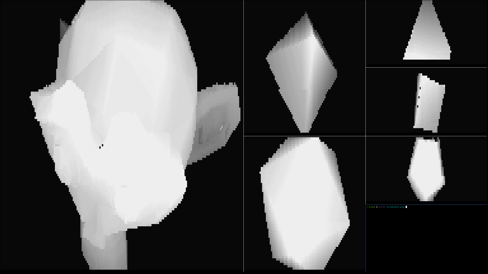

# rice3d

Animate 3d models in your terminal by rendering them using ascii characters




# Usage

```
./rice3d.py [FILE]
```

Where FILE points to a .obj file. There is an example model in the "models" folder.

If no argument is given a model is chosen at random

# Requirments

- Python3
- Terminal with 256 color support
- Terminal that can display [block elements](https://en.wikipedia.org/wiki/Block_Elements)
