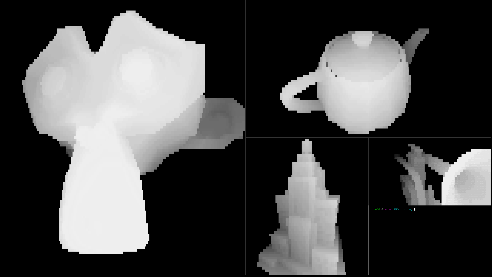

# rice3d

Animate 3d models in your terminal by rendering them using ascii characters




# Usage

```
./rice3d.py [FILE]
```

Where FILE points to a .obj file. There are example models in the "models" folder.

# Requirments

- Python3
